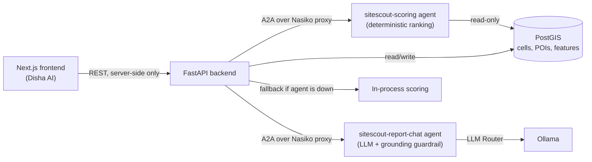

<p align="center">
  
</p>

<h1 align="center">Disha AI</h1>

<p align="center">
  <b>AI-driven site-selection intelligence.</b><br />
  Pick a city, a category and a tier — get every zone in the city scored, ranked and explained in seconds.
</p>

<p align="center">
  Built for the <a href="https://x.com/nasikolabs">Nasiko</a> Build-A-Thon, deployed on real
  <a href="https://x.com/nasikolabs">Nasiko</a> A2A agents.
</p>

<p align="center">
  🎥 <a href="https://youtu.be/dw0axWayp5k">Demo video</a>
</p>

---

## What it does

Aspiring store owners — cafés, clothing stores, pharmacies — usually pick a location on gut feeling
or a broker's word, with no way to compare zones on real data. **Disha AI** turns that into a
data-backed decision.

Given a city, a business category and a target tier (budget / mid / premium), it:

1. Divides the city into thousands of H3 hexagonal cells and scores **every one of them** against
   9 weighted signals — anchor footfall, affluence fit, residential demand, retail clustering,
   competition, gap opportunity, accessibility, rent efficiency and growth momentum — computed from
   live OpenStreetMap data in PostGIS.
2. Ranks the top zones with a real, numbers-backed narrative for each: what's working, what to
   watch out for, and why it ranked where it did.
3. Lets you ask natural-language follow-up questions about the results, answered by an LLM agent
   with a **grounding guardrail** — it will only state a number that's actually in the analysis
   data, and says so honestly when it can't produce a fully grounded answer rather than guessing.
4. Gives you a full analytics report: a city-wide score distribution across every evaluated zone,
   a confidence-vs-score view, and a per-signal contribution matrix — so the ranking is never a
   black box.

## Why it's real, not a demo shell

Every number on screen comes from a live computation, not a fixture:

- Scoring runs on a **deployed Nasiko A2A agent** (`sitescout-scoring`), called by the backend over
  the real Nasiko proxy, with automatic local fallback if the agent is unreachable.
- Follow-up chat runs on a second **deployed Nasiko A2A agent** (`sitescout-report-chat`), which
  calls Ollama through Nasiko's LLM Router and validates every answer against the underlying data
  before returning it.
- Both were verified live by killing the agent containers mid-session and confirming the system
  degrades gracefully (falls back locally, or answers honestly that it can't reach the agent)
  instead of failing silently.

## Architecture



## Tech stack

| Layer | Technology |
|---|---|
| Frontend | Next.js 16, React 19, Tailwind CSS, Recharts, Leaflet |
| Backend | FastAPI, SQLAlchemy, Pydantic |
| Database | PostgreSQL + PostGIS |
| Agents | Nasiko (A2A protocol), deployed as containerized services |
| LLM | Ollama (local, primary) with an OpenRouter free-tier backup path |
| Data | OpenStreetMap (via Overpass), H3 geospatial indexing |
| Infra | Docker Compose |

## Project structure

```
backend/            FastAPI backend: API routes, scoring orchestration, Nasiko client
scoring/             Deterministic scoring library (the 9 weighted signals)
pipelines/           Data ingestion, feature engineering, rent estimation
agents/              Nasiko A2A agents (scoring, report-chat, hello-world)
frontend/next-app/   Disha AI — the Next.js app (this is the live product)
frontend/streamlit_app/  An earlier Streamlit interface
shared/              Shared config and LLM client used across the backend and agents
scripts/             Deployment, smoke testing, back-testing utilities
```

## Getting started

Prerequisites: Docker Desktop, Python 3.11+, Node.js 20+, and a running
[Nasiko](https://github.com/Nasiko-Labs/nasiko) instance.

```bash
# 1. Database and backend
cp .env.example .env        # fill in BACKEND_API_KEY, NASIKO_USERNAME/PASSWORD, etc.
docker compose up -d --build

# 2. Deploy the Nasiko agents
python -m scripts.deploy_agent scoring \
  --include agent_base=agents/_shared --include backend=backend --include shared=shared \
  --include scoring=scoring --include pipelines=pipelines --data config=config
python -m scripts.deploy_agent report_chat \
  --include agent_base=agents/_shared --include backend=backend --include shared=shared

# 3. Frontend
cd frontend/next-app
npm install
cp .env.example .env.local  # BACKEND_URL, BACKEND_API_KEY, NEXT_PUBLIC_CARTO_API_KEY
npm run dev
```

Then open `http://localhost:3000`.

## Acknowledgments

Built in one day at the **Nasiko Build-A-Thon**. Thanks to the
[Nasiko](https://www.linkedin.com/company/nasikolabs), [DronaHQ](https://www.linkedin.com/company/deltecs-infotech)
and [Anakin](https://www.linkedin.com/company/anakintech) teams for the platform, the mentorship
and the day itself.
